# Learning Notes: Fundamentals of Remote Sensing

## Summary

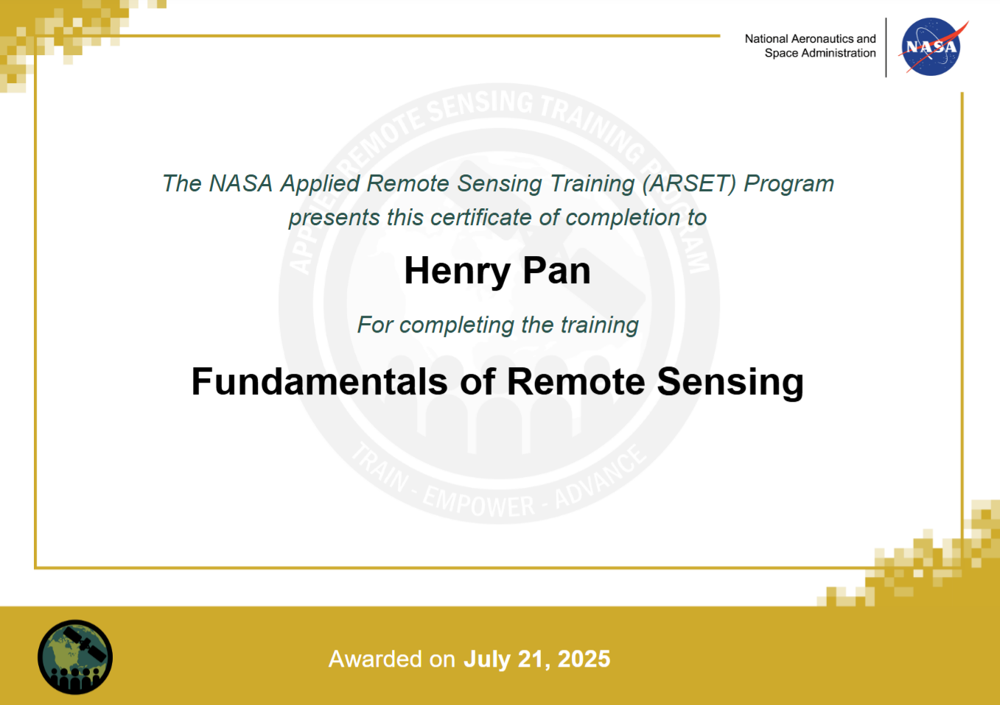

**Usage Notes:**
- Figures without explicit source attribution are original works by the author; most are accompanied by Python source code.
- Quoted text is excerpted verbatim from the course; most main text reflects personal insights.
- 💡 *Inspiration #n* -- Inspiration Moments: flashes of insight during study, checked by GPT but not guaranteed to be correct.
- The course referenced for these notes is listed in the References section at the end.

**Summary:**
This document provides a comprehensive overview of remote sensing fundamentals, covering the principles of electromagnetic radiation, sensor and satellite types, data processing levels, and practical applications. It emphasizes the trade-offs in satellite design, the importance of spectral, spatial, temporal, and radiometric resolutions, and the strengths and limitations of remote sensing for Earth observation. The notes combine course content, personal reflections, and illustrative examples to facilitate a deeper understanding of remote sensing concepts.

## Module 1: Why Earth Observations?

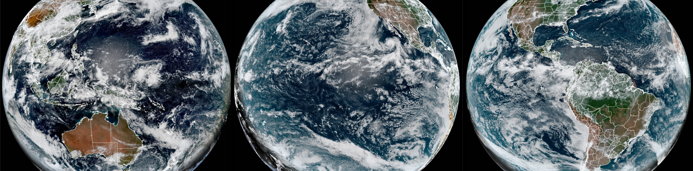

*Image Source: NASA*

### Earth is a System of Systems


*Image Source:  NASA*

> Earth is the planet NASA studies more than any other. Like our own bodies, the Earth is made up of connected, but different systems that interact in complex ways

### Why Study Earth from Space?

**Satellites provide global observations** (covering oceans, glaciers, and dense forests), **high reliability** (NASA consistently offers accurate and trusted data), **long-term records** (decades of consistent measurements to track Earth’s changes), **data for everyone** (scientists and professionals use it for informed decisions), and **international cooperation** (sharing information worldwide for the benefit of all).

### How Are Earth Observations Made?

Electromagnetic radiation is the energy carrier that makes remote sensing possible; by analyzing how Earth’s surfaces absorb, reflect, scatter, or emit radiation at different wavelengths, scientists can identify and quantify physical features of land, water, and atmosphere.

## Module 2: What is Remote Sensing?

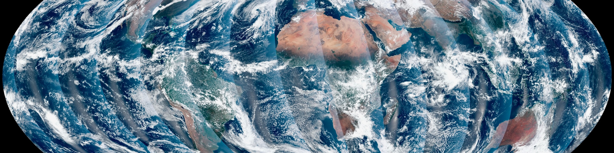

*Image Source: ARSET*

### Objectives

- Define remote sensing terms
- Know EM spectrum & wavelength ranges
- Link spectral traits to surface identification
- Use spectral signatures(光谱特征) for land/water/atmosphere
- Consider atmospheric effects

**Keywords**: active vs. passive, spatial/temporal/spectral/radiometric resolution, EM spectrum, spectral signatures, atmospheric windows

> Remote Sensing is the process of collecting information about objects from a distance, without being in physical contact with them


*Image Source:  discoveryeye.org*

**Human color vision relies on three types of cone cells**: blue (~10%), green (~30%), and red (~60%).
These cones, concentrated in the macula(黄斑区) of the retina(视网膜), are sensitive to different wavelengths, and the brain compares their responses to distinguish colors.

> Artificial remote sensors, such as cameras and satellite instruments, use a similar process

💡 *Inspiration #1*

👁️ **Human eye = A three-color camera**
 Only detects RGB primary colors, similar to the simplest 3-band remote sensing.

📷 **Regular camera = An upgraded human eye**
 Some cameras have NIR filters, allowing them to “see one more band,” similar to basic remote sensing sensors.

🛰️ **Satellite = A multi-band scientific camera**
 Detects not only RGB but also invisible bands such as NIR, SWIR, TIR, and microwave, enabling the identification of vegetation health, soil moisture, and even sea surface temperature.

> **Geophysical Parameters**(地球物理参数): Scientists refer to measurable properties within the Earth's systems as geophysical parameters.

### Electromagnetic Radiation

> Electromagnetic radiation is often referred to as light, electromagnetic energy, or electromagnetic waves

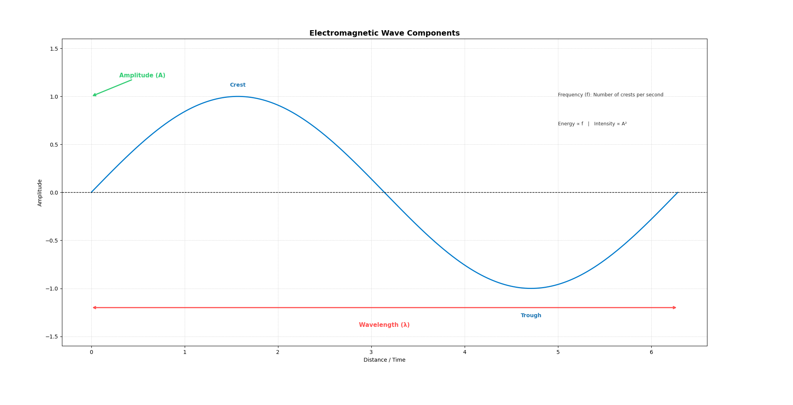

> Electromagnetic waves can be described by their frequency, wavelength, and amplitude

### Wave Behaviors

> **Incident Radiation**(入射辐射): The incoming electromagnetic energy that hits a surface is called incident radiation（入射辐射）

> Some ways that waves are affected when encountering an object are **reflection**, **absorption**, **scatter**, **transmission**, and **emission** (and re-emission) and are described below

```php
     Electromagnetic Wave 
(Input: known wavelength & energy)
            ↓
    [Material / Surface]
(acts like a function, interacts with EM waves)
            ↓
 ┌─────────────────────────────┐
 │  Reflection  |  Absorption  │
 │  Scattering  | Transmission │
 │  Emission                   │
 └─────────────────────────────┘
            ↓
       Output Signal 
 (radiance / intensity / spectral signature)
            ↓
      Modeling & Retrieval
 (derive physical & biological properties)
```

💡 *Inspiration #2*

Remote sensing treats materials as functions of electromagnetic wave interaction. By analyzing how input radiation is reflected, absorbed, scattered, transmitted, or emitted, we can mathematically model and retrieve the physical properties of surfaces.

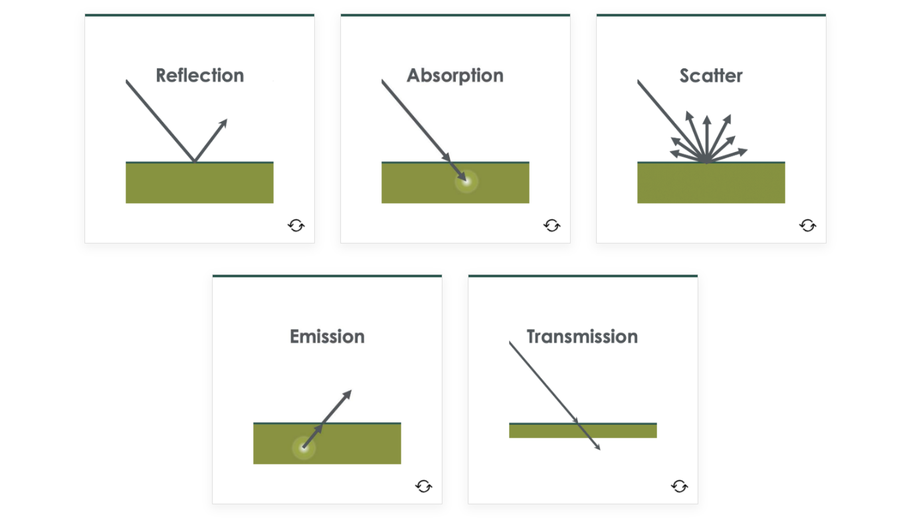

*Image Source:  ARSET*

#### Pseudocode description - by Python

```python
# Define electromagnetic wave input
class ElectromagneticWave:
    def __init__(self, wavelength, energy):
        self.wavelength = wavelength      # in nm or μm
        self.energy = energy              # E = h * f

# Define material as a "function" that interacts with EM waves
class Material:
    def __init__(self, name, spectral_signature):
        self.name = name
        self.spectral_signature = spectral_signature  # dict: {wavelength: reflectance}

    def interact(self, wave: ElectromagneticWave):
        # Simplified interaction model
        reflection = self._reflectance(wave.wavelength)
        absorption = 1 - reflection      # simplified: no transmission/emission
        return {
            "reflection": reflection,
            "absorption": absorption,
            "scattering": self._scattering(wave.wavelength),
            "emission": self._emission(wave.wavelength)
        }

    def _reflectance(self, wavelength):
        return self.spectral_signature.get(wavelength, 0.1)

    def _scattering(self, wavelength):
        return 0.05 * (1 / wavelength)   # toy model

    def _emission(self, wavelength):
        return 0.02 * wavelength         # toy model

# Modeling process: retrieve physical properties from interaction outputs
def model_surface_property(interaction_output):
    # Example: vegetation health estimation using reflection (NDVI logic simplified)
    refl = interaction_output["reflection"]
    if refl > 0.5:
        return "Healthy vegetation"
    else:
        return "Stressed vegetation or non-vegetation"

# Example workflow
wave = ElectromagneticWave(wavelength=850, energy=None)  # Near Infrared
mangrove = Material("Mangrove", spectral_signature={850: 0.6})
interaction = mangrove.interact(wave)
result = model_surface_property(interaction)

print(f"Material: {mangrove.name}")
print(f"Interaction: {interaction}")
print(f"Model Output: {result}")
```

#### DEMO: illustrates the fundamental remote sensing process

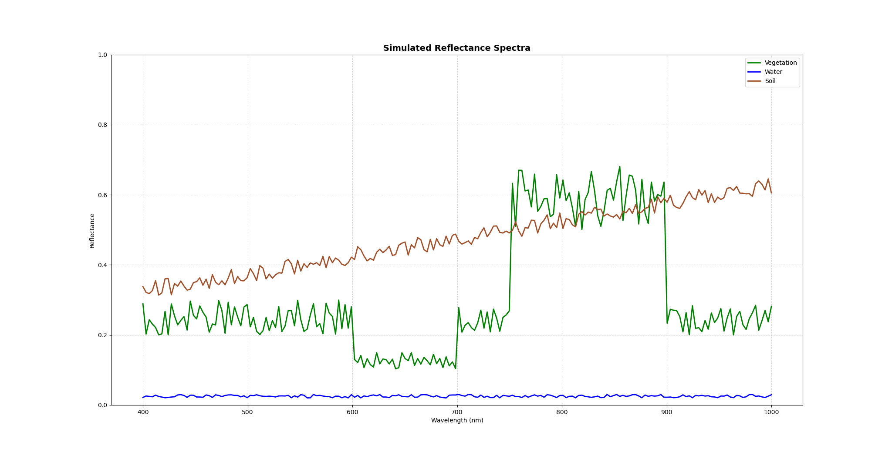

Note: Electromagnetic waves (input) interact with different surface materials, producing distinct reflection patterns (output signals). The simulated spectra show how vegetation strongly absorbs red light but reflects near-infrared, water remains dark across all bands, and soil exhibits moderate reflectance increasing with wavelength. These signals, once captured by sensors, can be modeled to retrieve surface properties, forming the basis of remote sensing analysis.

> **Polarization** is another property of electromagnetic waves: the measurement of the electromagnetic field's alignment

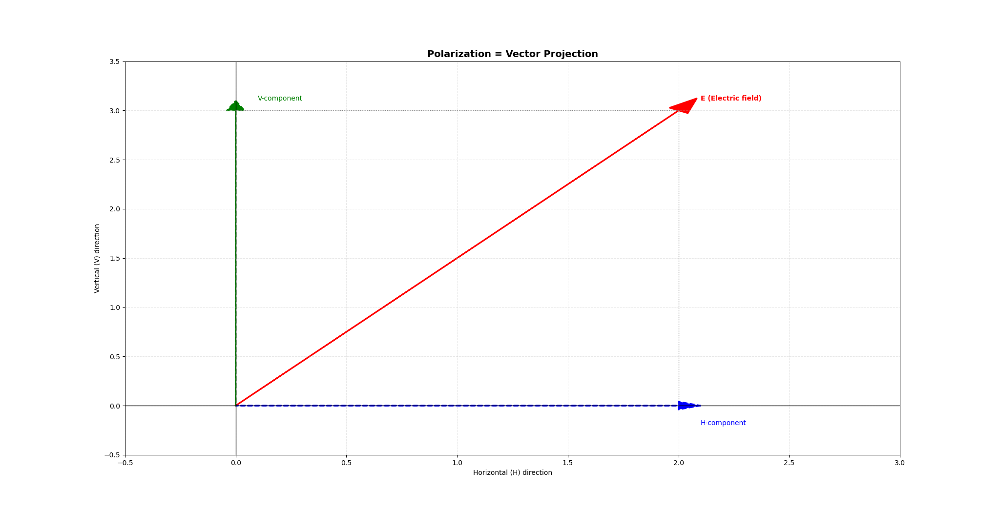

💡 *Inspiration #3*

**Polarization** in remote sensing can be understood as projecting the electromagnetic wave’s electric field vector onto specific directions (H, V). Like vector projection in linear algebra, it reorganizes the information space, allowing sensors to extract distinctive scattering features and even reduce redundant dimensions for better material characterization.

### The Electromagnetic Spectrum

> The electromagnetic spectrum ranges from very long-wavelength, low-frequency, low-energy radio waves to very short-wavelength, high-frequency, high-energy gamma rays

> Humans can only see visible light, which is a very narrow range of the spectrum (0.0035%)

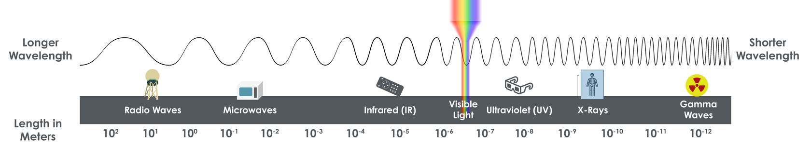

*Image Source:  ARSET*

| **Region**      | **Wavelengths**                       | **Example Remote Sensing Use**                               |
| --------------- | ------------------------------------- | ------------------------------------------------------------ |
| **Radio Waves** | 1 m – 100 km (1 – 10⁵ m)              | Measuring atmospheric humidity, cloud types/amounts, wind speeds/direction, precipitation types/amounts |
| **Microwaves**  | 1 mm (10⁻³ m) – 100 mm (10⁻¹ m)       | Tracking global weather patterns (sea surface heights, precipitation), measuring surface temperatures, soil moisture |
| **Infrared**    | 0.75 – 100 µm (7.5×10⁻⁷ – 10⁻⁴ m)     | Observing vegetation health and soil composition             |
| **→ NIR**       | 0.75 – 1.4 µm (7.5×10⁻⁷ – 1.4×10⁻⁶ m) | Vegetation monitoring, water body delineation                |
| **→ SWIR**      | 1.4 – 4 µm (1.4×10⁻⁶ – 3×10⁻⁶ m)      | Soil moisture, vegetation stress, mineral mapping            |
| **→ LWIR/TIR**  | 8 – 15 µm (8×10⁻⁶ – 1.5×10⁻⁵ m)       | Thermal imaging, surface temperature                         |
| **Visible**     | 750 – 400 nm (7.5×10⁻⁷ – 4×10⁻⁷ m)    | Observing water features, phytoplankton, soil, atmospheric trace gases, aerosols |
| **→ Red**       | ~690 nm                               | Vegetation (chlorophyll absorption)                          |
| **→ Green**     | ~530 nm                               | Vegetation and phytoplankton                                 |
| **→ Blue**      | ~420 nm                               | Water features, atmospheric particles                        |
| **Ultraviolet** | 100 – 1 nm (10⁻⁷ – 10⁻⁹ m)            | Measuring ozone and air quality                              |
| **X-Ray**       | 1 – 100 pm (10⁻¹² – 10⁻¹⁰ m)          | Completely absorbed by atmosphere; not generally used for Earth remote sensing |
| **Gamma Ray**   | 1 – 100 fm (10⁻¹⁵ – 10⁻¹³ m)          | Completely absorbed by atmosphere; not used for Earth observations |

- Longer wavelength → generally stronger penetration (but depends on medium).

- Infrared lies to the longer-wavelength side of visible light, Ultraviolet to the shorter-wavelength side.

- Remote sensing rarely extends to X-ray due to strong atmospheric absorption; practical applications focus on IR and microwave regions.

> In Earth satellite remote sensing, we are mostly concerned with wavelengths from ultraviolet (0.1 µm) through the microwave (100,000 µm)

### Spectral Signatures

> Different wavelengths of the electromagnetic spectrum interact differently with the physical properties of materials that make up the Earth’s surface and atmosphere

> **Spectral signature**(光谱特征): The spectral response (how the material reflects, absorbs, or emits radiation) is called the object’s spectral signature

A Spectral Signature is an object's "fingerprint."

> **Percent reflectance**(反射率百分比): The percent reflectance is the ratio of reflected energy compared to the total incident energy on the object at a given wavelength

> **Radiance**(辐射率): A measure of the power of the electromagnetic radiation emitted from an object per unit area for a given wavelength

> **Surface Albedo**(地表反照率): Is equivalent to percent reflectance, the fraction of incident radiation that is reflected by the Earth's surface for a given location and time

**Percent reflectance** tells us *how a surface behaves at specific wavelengths*, useful for material identification, whereas **surface albedo** summarizes *how much total solar energy is reflected*, essential for climate and energy balance studies.

#### Remote Sensing and Spectral Signatures

- **Color Perception**: The color of a material equals the part of visible light it does **not** absorb; plants look green because chlorophyll absorbs red & blue light but reflects green.
- **Trace Gas（痕量气体） vs GHG**: Greenhouse gases are a subset of trace gases; all GHGs are trace gases, but not all trace gases contribute to the greenhouse effect.

.jpg)

*Image Source:  ARSET*

**Vegetation Identification**

- Characterized by **high NIR reflectance** and **low visible reflectance**.

**Vegetation Type Classification**

- Achieved by comparing **detected spectral signatures** with **known references** (e.g., broadleaf, needleleaf, trees, grasses).

**Vegetation Indices**

- Calculated from **specific wavelength reflectances** to describe **greenness** (density & health) at the **pixel level** in satellite images.

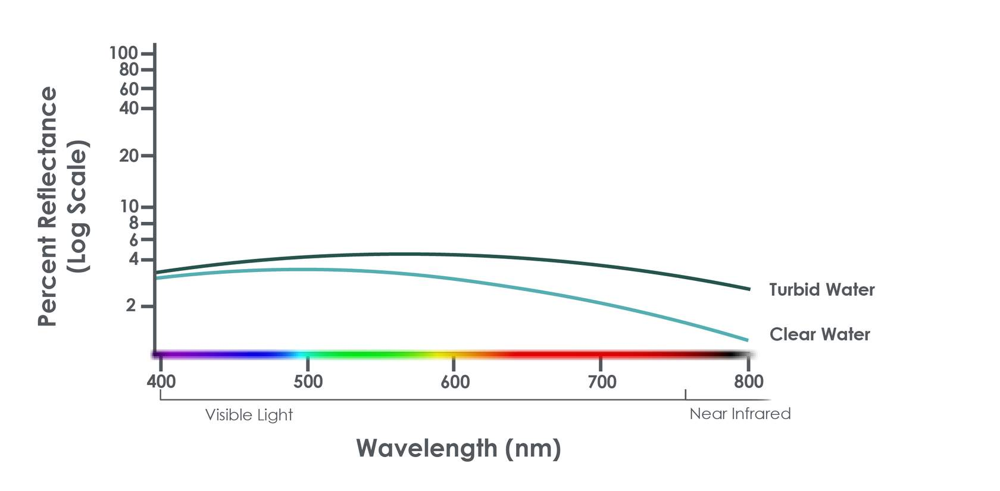

*Image Source:  ARSET*

**Principle**

- Aquatic remote sensing depends on **water’s inherent optical properties** (biological, chemical, physical processes).
- **Reflectance = f(backscattering, absorption)** from water, sediments, phytoplankton, and colored dissolved organic matter (CDOM).

**Spectral Characteristics**

- **Clear water**: **Longer wavelengths absorbed**, **shorter wavelengths reflected**.
- **Turbid water**: Sediments increase **long-wavelength reflectance**.
- **Chlorophyll-rich water**: **Higher green reflectance**, **lower blue reflectance**.

**Applications**

- Monitoring **algae, water temperature, water levels, pollutants, suspended particles**.
- Essential for understanding **marine and freshwater ecosystems**.

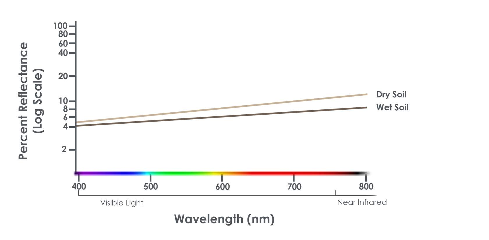

Image Source:  ARSET

**Principle**

- **Reflected / backscattered EM radiation** reveals soil properties, supports agriculture, and assesses land degradation.

**Spectral Characteristics**

- **Visible & SWIR**: Estimate **soil organic carbon**; detect **minerals (e.g., iron oxide)**.
- **NIR**: **Moisture lowers NIR reflectance**.
- **Microwave**: Penetrates soil surface → **soil moisture estimation**.

**Applications**

- Assessing **soil health & fertility**
- Monitoring **soil moisture changes**
- Investigating **organic matter content**
- Studying **soil erosion**
- Deriving **vegetative cover information**

#### Atmospheric Interference

> All remote sensors, including targets on the Earth's surface, must account for the effects of the atmosphere on the wavelengths they are detecting to observe targeted materials

$$
L 
sensor
​
 =L 
path
​
 +T(λ)⋅L 
surface
​
 +L 
upward emission
​
$$

The atmosphere behaves as an independent material with absorption, scattering, and emission effects. It influences both top-down (solar incoming) and bottom-up (surface-emitted/reflected) radiation, making atmospheric correction a necessary step in quantitative remote sensing.

## Module 3: How Does Remote Sensing Work?

### 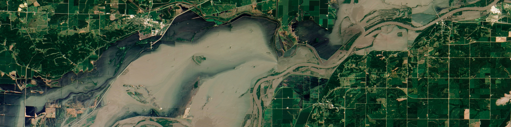

*Image Source: NASA*

### Objectives

- Understand the key enablers of remote sensing: satellites (platforms) and sensors (tools).

- Learn the key satellite and sensor characteristics for evaluating remote sensing capabilities: orbit, energy source, spectral range & resolution, spatial resolution, temporal resolution, and radiometric resolution.

- Recognize that no single tool fits all purposes; select appropriate tools and parameters based on specific mission goals.

- Review examples of NASA Earth science satellites and sensors to reinforce these concepts.

### Satellites and Sensors

> Each satellite has unique orbit characteristics and can have one or more sensors, or instruments of different types

#### Types of Satellite Remote Sensors

> Sometimes, the terms “satellite” and “sensor” are used interchangeably...but they are not the same.

Remote sensing tools are diverse. By altitude, they can be classified into ground-based platforms (e.g., towers), airborne platforms (e.g., balloons and aircraft), and spaceborne platforms (e.g., satellites).

[Instruments | NASA Earthdata](https://www.earthdata.nasa.gov/data/instruments)

| **Mission**   | **Launch Date** | **Main Instruments**                                   | **Key Features**                                             | **Key Applications**                                         |
| ------------- | --------------- | ------------------------------------------------------ | ------------------------------------------------------------ | ------------------------------------------------------------ |
| **Landsat 9** | Sep 27, 2021    | OLI-2 (Visible, NIR, SWIR), TIRS-2 (TIR)               | 15–30 m resolution; longest continuous land record           | Land cover/use change, vegetation indices, soil/thermal analysis |
| **VIIRS**     | Oct 28, 2011    | VIIRS (Visible, NIR, SWIR, LWIR)                       | 375–750 m resolution; daily global coverage                  | Clouds, aerosols, SST, ocean color, land surface temperature, fires |
| **TEMPO**     | Apr 7, 2023     | TEMPO Spectrometer (UV & Visible)                      | Hourly air quality over N. Hemisphere                        | Trace gases, pollutants, air quality, climate impacts        |
| **NISAR**     | 2025            | L-band & S-band SAR (polarimetric)                     | Penetrates clouds & vegetation; cm-level land motion         | Land surface changes (landslides, earthquakes, floods, glacier/coastline monitoring) |
| **GPM**       | Feb 27, 2014    | GMI (Microwave Radiometer), DPR (Dual-frequency Radar) | Reference standard for precipitation; dual-frequency depth sensing | Rain/snow rates, cloud ice & water content, global precipitation calibration |

### Characteristics Overview

> Mission science questions drive the design of satellite and sensor functional characteristics

Satellites are categorized by their orbits and science applications

Sensors are identified by their **energy source**, **resolutions**, **spectral ranges**, and **target applications**

### Orbits

> Satellites orbit around the Earth in various ways that define how much and how often the satellite’s sensors view a particular portion of the Earth

#### Geostationary Earth Orbit (GEO)

💡 *Inspiration #4*

A geostationary satellite is like a giant flashlight fixed over the equator: it moves with Earth’s rotation so its “light spot” remains stable on the ground, even though the satellite itself is constantly moving in space.

#### Low-Earth Orbit (LEO)

- LEO: Polar-Orbiting - Polar-orbiting satellites travel from pole to pole as the Earth rotates beneath them
  - LEO Polar-Orbiting Sun-Synchronous
    - Satellite overpass always occurs at the same local time
    - Generally, one overpass for day and one for night (more overlap at high latitudes)
    - Polar-orbit allows for global coverage over a period of time
  - LEO Polar-Orbiting and Non-Sun-Synchronous
    - The main difference is that the polar-orbiting satellite does not maintain a consistent local solar time over its ground track as a Sun-synchronous satellite does.

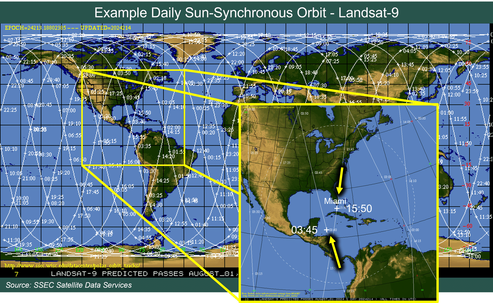

A Sun-synchronous orbit guarantees consistent local solar time for observations but not frequent revisits; high-resolution sensors often have a narrow swath, resulting in longer revisit times despite the satellite’s frequent orbital passes.

- LEO: Non-Polar (Inclined Orbit)
  - Irregular overpass times of the satellite
  - More frequent overpasses at low and mid latitudes than sun-synchronous
  - Crosses path of polar-orbiting satellites that can be used for comparison
  - Non-polar orbits do not provide global coverage

| **Orbit Type**                                   | **Strengths**                                                | **Limitations**                                              |
| ------------------------------------------------ | ------------------------------------------------------------ | ------------------------------------------------------------ |
| **GEO (Geostationary)**                          | - Observations every few minutes → ideal for rapidly changing events (e.g., thunderstorms)  <br>- Continuous monitoring for environmental (weather) & communications applications | - Covers only a portion of the Earth  <br/>- Poor observation quality in polar regions |
| **LEO (Low Earth Orbit, incl. Sun-synchronous)** | - Provides global coverage  <br/>- Observations occur at consistent local time  <br/>- High-quality observations in polar regions | - Less frequent observations than GEO (typically ~1 pass/day or night per location, sometimes less) |

### Energy Source: Passive/Active

> The sensor's energy source is a characteristic that is categorized as either passive or active

| **Type**            | **Energy Source**                          | **Working Principle**                                        | **Day/Night Usability**                     | **Examples**                   |
| ------------------- | ------------------------------------------ | ------------------------------------------------------------ | ------------------------------------------- | ------------------------------ |
| **Passive Sensors** | **External** (mainly solar radiation)      | Detect reflected solar radiation (day) and emitted thermal radiation (night) | Limited at night (mainly thermal IR usable) | MODIS, VIIRS, Landsat OLI      |
| **Active Sensors**  | **Self-generated** (onboard energy source) | Emit radiation toward Earth and measure the returned signal (backscatter or reflection) | Can be used **day or night**                | SAR (Sentinel-1, NISAR), LiDAR |

Active sensors are powerful but costly and best for structural or geometric studies, while passive sensors are simpler, energy-efficient, and ideal for large-scale, long-term monitoring of Earth’s natural radiative properties

> One method of active remote sensing is Light Detection and Ranging (lidar or LiDAR) which uses light in the form of a pulsed laser to measure the distances to the Earth from the satellite

### Spectral Range & Resolution

> Spectral range determines which electromagnetic wavelengths are detected and spectral resolution determines how precisely the sensor detects them

> **Spectral Channel/Band**: A satellite sensor band contains a relatively narrow range of wavelengths. A sensor is designed to detect several bands, or channels, of radiation. The sensor bands are generally numbered

> **Spectral Range**: the breadth of wavelengths that are detected by the instrument across portions of the electromagnetic spectrum

### Spectral Resolution

> **Spectral Resolution**: the instrument's detection precision of a particular portion of the electromagnetic spectrum

> Typically, multispectral sensors observe at three or more bands, while hyperspectral sensors detect hundreds or thousands of very narrow bands (i.e., very high spectral resolution) to remotely sense very specific materials, such as gases in the atmosphere

### Spatial Resolution and Coverage

> The spatial resolution of a sensor represents the surface area of the Earth that is contained within one pixel in the resulting image from the remotely sensed data…Each pixel has two characteristics or pieces of information, an intensity and a location

#### Spatial Resolution: Fixed or Variable?

The finest spatial resolution occurs at nadir because, like a flashlight shining vertically, the same sensor energy is concentrated on a smaller ground area, whereas at oblique angles it spreads over a larger area, reducing resolution.

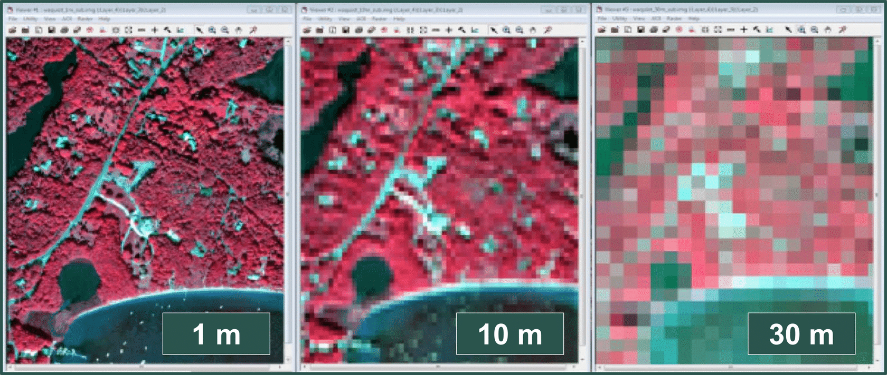

*Source: csc.NOAA.gov*

#### Spatial Coverage

> **field of regard**（视场）: some GEO sensors have scan strategies that limit the instrument view to only a portion of the entire full disk

### Temporal Resolution

> Temporal resolution refers to how frequently a satellite instrument can provide an observation of the same point on the Earth

💡 *Inspiration #5*

Spectral resolution defines how finely a sensor can distinguish electromagnetic wavelengths, spatial resolution defines the ground area represented by each pixel, and temporal resolution defines how frequently the same location is observed

> Other polar-orbiting LEO instruments with very high spatial resolution tend to have narrow swaths, and thus very large gaps in satellite observations occur between orbits

High spatial resolution reduces swath width, leading to lower temporal resolution, **mainly due to geometric and orbital constraints rather than sensor quality**. Wider and clearer imaging can be improved by larger optics and satellite constellations, but single-satellite performance is fundamentally limited by orbital mechanics and diffraction


AHI alternates between full-disk scans and targeted “high-frequency” rectangular regions to monitor key areas such as Japan or typhoon zones. These priority regions can be updated by ground commands, but the number and size are constrained by scanning mechanics and operational priorities.

### Radiometric Resolution

> Radiometric resolution is the satellite sensor's ability to discriminate small differences in radiation magnitude for a given band at every pixel in the image

Spectral resolution is about “how many wavelengths you can separate”, while radiometric resolution is about “how finely you can detect energy intensity within each band.”

💡 *Inspiration #6*

Spectral resolution is like distinguishing different colors, while radiometric resolution is like tasting subtle differences in the same wine.

#### Data Storage in Bits

> All data is stored as a group of bits (like a computer). The greater the number of bits used, the greater the radiometric resolution

Radiometric resolution **increases exponentially with bit depth**, but higher bit depths impose heavy data and processing burdens, so it’s a trade-off between sensitivity and system capacity

### Tradeoffs and Examples

> There are always tradeoffs when designing the satellite and instruments to meet the scientific needs

Trade-offs in Satellite Design for Different Missions

| **Mission Objective**                                        | **Prioritized Resolution(s)**                          | **Technical Approach**                                       | **Trade-offs (Sacrificed Parameters)**                       | **Typical Example**                        |
| ------------------------------------------------------------ | ------------------------------------------------------ | ------------------------------------------------------------ | ------------------------------------------------------------ | ------------------------------------------ |
| **Disaster Early Warning** (e.g., hurricanes, wildfires, dust storms) | **High Temporal Resolution**                           | - Use of GEO satellites for continuous monitoring <br>- Constellations of multiple LEO satellites <br/>- Rapid data transmission | - **Lower Spectral Resolution** (fewer bands) <br/>- **Lower Radiometric Resolution** (fewer bits) to reduce data volume | Himawari, GOES series (weather satellites) |
| **Fine Material Discrimination & Detailed Observation**      | **High Spatial Resolution + High Spectral Resolution** | - Narrower swath width to improve pixel detail <br/>- High-resolution imagers | - **Lower Temporal Resolution** (longer revisit time) <br/>- Possible sacrifice of spectral continuity (e.g., panchromatic imagery uses a single broad band) | WorldView, GeoEye (panchromatic imagery)   |

## Module 4: How Can I Use Remote Sensing Data?

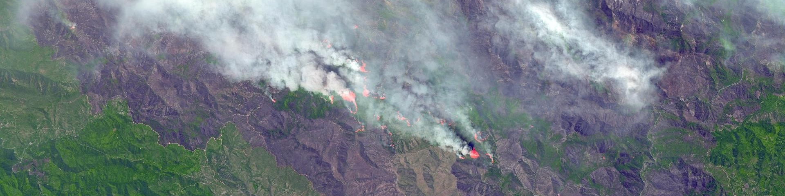

*Image Source: NASA*

### Objectives

- Understand different levels of remote sensing data products through case studies
- Learn basic methods to process various data level
- Recognize the strengths and weaknesses of using remote sensing for Earth observation

### Creating Satellite Imagery

Remote sensing data is typically visualized as **satellite imagery**, which may be single-channel or multi-channel composites; although the sensor records quantitative values, these are mapped into colors for qualitative human interpretation

> Radiance is often quantified using a Brightness Temperature scale, expressed in degrees Celsius

$$
\underbrace{
\begin{bmatrix}
\mathbf{b}_{\lambda_1} \\
\mathbf{b}_{\lambda_2} \\
\vdots \\
\mathbf{b}_{\lambda_m}
\end{bmatrix}
}_{\text{Observation vector } (\mathbf{b})}
=
\underbrace{
\begin{bmatrix}
\mathbf{A}_{\lambda_1} & 0 & \cdots & 0 \\
0 & \mathbf{A}_{\lambda_2} & \cdots & 0 \\
\vdots & \vdots & \ddots & \vdots \\
0 & 0 & \cdots & \mathbf{A}_{\lambda_m}
\end{bmatrix}
}_{\text{System block-diagonal matrix } (\mathbf{A})}
\underbrace{
\begin{bmatrix}
\mathbf{x}_{\lambda_1} \\
\mathbf{x}_{\lambda_2} \\
\vdots \\
\mathbf{x}_{\lambda_m}
\end{bmatrix}
}_{\text{Surface reflectance vector } (\mathbf{x})}
$$

The satellite imaging process is a linear mapping **b = Ax**, where **A** encodes atmospheric and sensor effects, and **x** represents the intrinsic surface reflectance as a tensor reshaped into a vector

Satellites capture individual spectral bands as grayscale images; RGB composites are created later for visualization, while many satellites record far more than just three visible bands

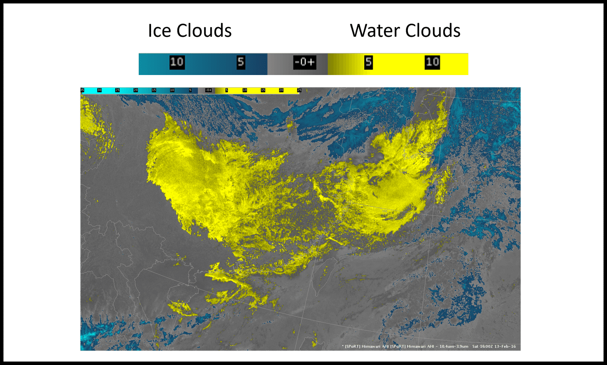

*Source: Himawari-8 AHI*

#### False Color Imagery

False color imagery assigns non-visible or non-natural bands to RGB channels to enhance the detection of specific features, such as vegetation health or water bodies.

A color bar is a visual legend that maps colors to numerical values, helping interpret data intensity or magnitude in scientific and remote sensing images.

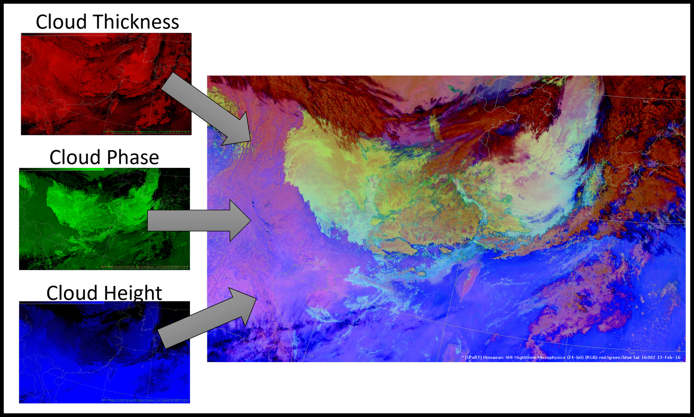

*Source: Himawari-8 AHI*

| **Observed Color**     | **Dominant Channel(s)** | **Physical Parameter**                  | **Atmospheric / Weather Interpretation**               |
| ---------------------- | ----------------------- | --------------------------------------- | ------------------------------------------------------ |
| **Bright White**       | R↑ G↑ B↑                | Thick cloud, water phase, high altitude | Deep convective clouds, strong precipitation potential |
| **Blue / Cyan**        | B↑ (G↓ R↓)              | High cloud, ice phase, cold cloud tops  | Cirrus or anvils; upper-level weather systems          |
| **Greenish**           | G↑ (R↓ B↓)              | Water phase cloud, medium thickness     | Low/mid-level stratocumulus or cumulus                 |
| **Reddish / Brownish** | R↑ (G↓ B↓)              | Thin cloud or bare surface              | Dust, desert surface, or thin cirrus overlay           |
| **Dark / Black**       | R↓ G↓ B↓                | Low reflectance (clear sky)             | Clear land/ocean surface, cloud-free regions           |

By mapping different physical parameters to RGB channels, satellite imagery enables **rapid qualitative assessment** of cloud thickness, phase, and height, turning quantitative radiance into intuitive weather diagnostics

### Satellite Data Levels

```
Level-0        →      Level-1     →        Level-2            →        Level-3         →      Level-4
(Raw Radiance)    (Georeferenced)    (Geophysical Quantities)    (Gridded, Aggregated)    (Model-Integrated)
```

Level-0→1: Decoding; Level-1→2: Data channeling; Level-2→3: Matrix structuring; Level-3→4: Database integration.

| **Data Analysis Term**               | **Satellite Data Level** | **Explanation**                                              |
| ------------------------------------ | ------------------------ | ------------------------------------------------------------ |
| Decoding                             | Level-0 → Level-1        | Raw encoded radiance is “decoded” by applying geometric referencing and satellite attitude information, essentially tagging each data point with geographic coordinates. |
| Data Channeling (Feature Extraction) | Level-1 → Level-2        | Retrieval algorithms transform raw signals into separate geophysical features (e.g., temperature, AOD, ocean color), similar to channeling data into different feature streams. |
| Matrix Structuring                   | Level-2 → Level-3        | Irregular pixel data are mapped onto uniform spatio-temporal grids, restructuring the dataset into standardized matrices or multidimensional arrays for easier computation. |
| Database Integration                 | Level-3 → Level-4        | Model outputs and multiple datasets are fused into a multi-dimensional database, enabling global queries, reasoning, and predictive analysis. |

Gridded data can be viewed as representing a continuous geophysical field in a **chosen basis**: L2 swath data correspond to observations in a non-standard basis, while L3 grids are a **change-of-basis projection** onto a regular vector space

💡 *Inspiration #7*

| **Linear Algebra Concept**      | **Remote Sensing Gridded Data Analogy**                      | **Analogy Value**                                            |
| ------------------------------- | ------------------------------------------------------------ | ------------------------------------------------------------ |
| **Basis Vectors**               | Regular latitude-longitude grid directions (lat, lon)        | Define the “coordinate system” for all data points           |
| **Vectors / Tensors**           | Pixel values (e.g., temperature, NDVI, reflectance)          | Each grid cell represents a vector component in the chosen basis |
| **Change of Basis**             | L2 swath data → L3 gridded data resampling                   | Explains why L3 loses precision: projection/interpolation error |
| **Linear Operators**            | Interpolation/resampling matrices, convolution kernels       | Data interpolation or spatial filtering can be treated as matrix multiplication |
| **Tensor Field Discretization** | Global climate fields or oceanographic fields as gridded data | Higher grid resolution ≈ higher-dimensional vector space with more degrees of freedom |

> Typically we recommend new users to start with Level-3 data since it is easier to use because it’s on a uniform grid...for applications needing very high spatial resolution, it may be necessary to go back to the Level-2 data

Inverse modeling generally uses Level-2 data to preserve native resolution and error statistics, while Level-3 gridded products are more suited for climatological and large-scale analyses

> All NASA data is available to the public at no cost through the [NASA Earthdata(opens in a new tab)](https://www.earthdata.nasa.gov/) website

### Advantages and Disdvantages of Remote Sensing

| **Advantages**                                               | **Disadvantages**                                            |
| ------------------------------------------------------------ | ------------------------------------------------------------ |
| ✅ **Wide coverage**: Comparable data available over large areas, remote regions, and globally | ❌ **Resolution trade-offs**: Design and cost constraints limit simultaneous optimization of spectral, spatial, temporal, and radiometric resolutions |
| ✅ **Consistent revisit frequency**: Satellites revisit locations at predictable and often higher frequencies than ground monitoring | ❌ **Need for ground validation**: Regional or local validation is recommended to ensure applicability to specific conditions |
| ✅ **Long-term archives**: Decades of data enable change detection and trend analysis | ❌ **Geographic restrictions**: Some sensors or datasets are not available for all regions |
| ✅ **Multiple detection capabilities**: Various resolution combinations (spectral, spatial, temporal, radiometric) | ❌ **Atmospheric interference**: Clouds, aerosols, or other particles may reduce accuracy or prevent observations |
| ✅ **Near-real-time observations**: Improved data transmission and processing | ❌ **Additional processing required**: Post-processing and visualization are often necessary |
| ✅ **Automated, analysis-ready products improve accessibility** | ❌ **Massive data volume**: Diverse formats and large datasets require significant processing time |
| ✅ **Low-cost access**: Free imagery, datasets, and tools enable cost-effective monitoring and analysis | ❌ **Not user-friendly for non-specialists**: Some satellite products are difficult for non-technical users to interpret |

Satellite remote sensing offers wide coverage, long-term comparable data, multiple resolution capabilities, and low-cost accessibility, but faces trade-offs in resolution, requires ground validation, is affected by atmospheric interference, and often demands complex data processing

### Observations to Applications

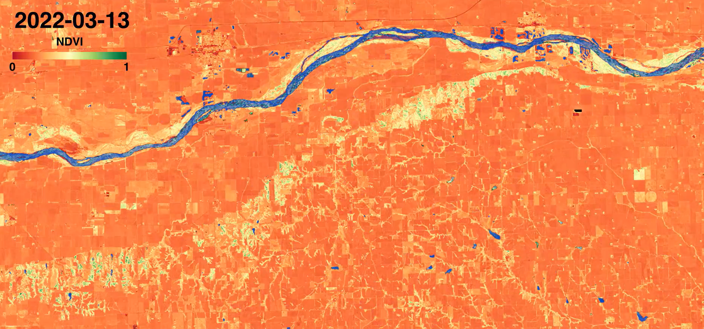

*Image Source: ARSET*


*Image Source: ARSET*

the vegetation get healthier (green) as we go from spring into summer, and less healthy (orange) going into fall

## Module 5: Practice with Worldview

### Activity: Introduction to Worldview

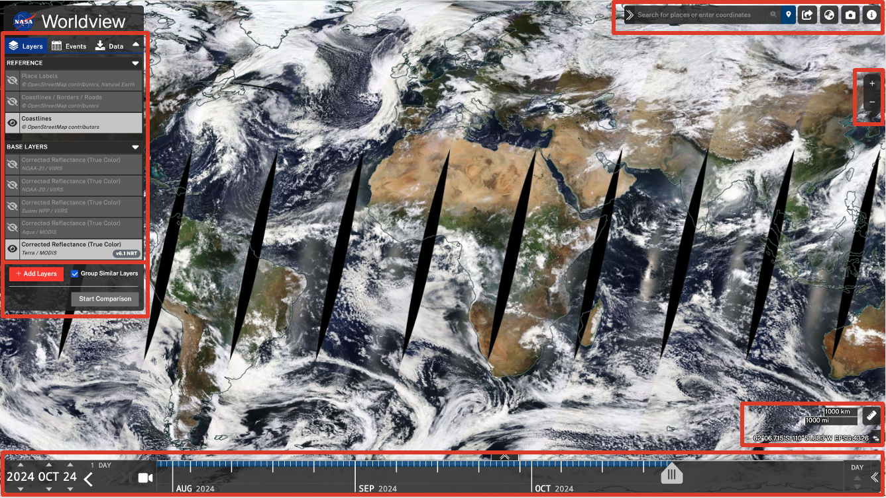
*Image Source: ARSET*

- **Layers, Events and Data Panel**: Layers work like Photoshop layers (toggle & reorder); Events are curated thematic datasets; Data tab enables downloading raw data for analysis
- **Layer Picker**: Layer Picker allows users to browse and add imagery layers by discipline or keyword, and the Start Comparison feature enables side-by-side analysis of imagery from different dates or datasets
- **Timeline**: The timeline’s start date is determined by the earliest available data for the selected layer, while the Date Selector only controls the current viewing endpoint, with a shortcut to the latest data
- **Map Coordinates and Measurement**: Measure Distance and Area in kilometers (km) or miles (mi) and export as GeoJSON

### Activity: Explore Wildfire Imagery in Worldview

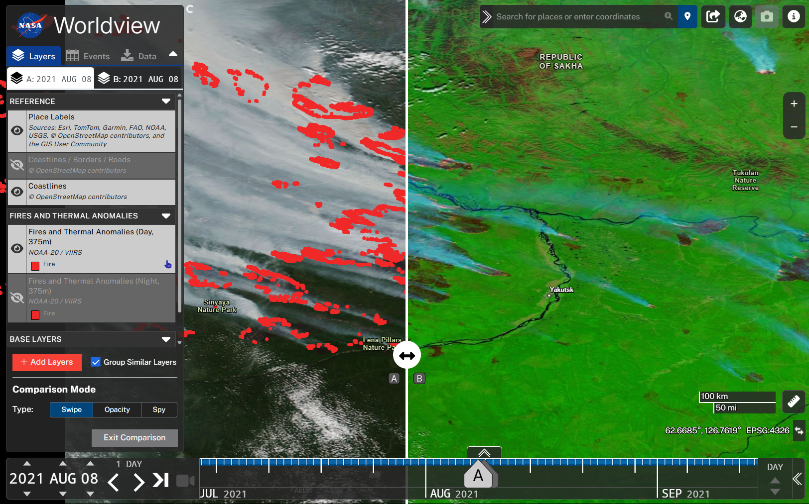
*Image Source: ARSET*

## Reference

*ARSET - Fundamentals of Remote Sensing*. NASA Applied Remote Sensing Training Program (ARSET).